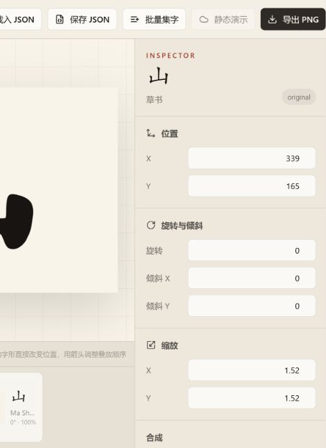

# Calligraphy Studio

面向书法集字排版的可扩展系统：把一个字从“图片文件”提升为带有来源、样式、几何变换、合成属性和生成状态的 `Glyph` 对象。

当前严格实现链路：

```text
MCCD / NCCU Cursive / Manifest Import
                  ↓
        Normalize + AssetStore
                  ↓
   SQLite Glyph Store + visual embeddings
                  ↓
       FastAPI Glyph / Search / Similarity
                  ↓
      React + Konva batch composition
                  ↓
   Project JSON + PNG + structural fallback
```

第一阶段、Hanzi Writer 结构 fallback 和第二阶段的可解释视觉 embedding / 相似字检索已经完成。AI 生成和云端同步仍保持阶段门槛。



## 在线演示

GitHub Pages 静态演示：<https://styayur.github.io/calligraphy-studio/>

静态版直接读取预导出的 Glyph、授权元数据和视觉相似度数据。搜索、批量集字、图层编辑、项目 JSON 和 PNG 导出可以离线运行；服务端项目保存及本地字体导入不会在公开页面执行。

## 已实现

- MCCD 官方 LMDB 布局读取：`num-samples`、`image-*`、`label-*`、`char-*`、`style-*`、`dynasty-*`
- NCCU 草书数据集导入：MIT 授权，包含真实 96×96 草书字形子集
- OFL-1.1 字体字形导入：Ma Shan Zheng 楷书、Zhi Mang Xing 行书、Liu Jian Mao Cao 草书
- 通用字体清单导入：支持 OFL、Apache、GPL 字体例外、ARPHIC 和用户自备非商用授权
- CSV / JSON / JSONL 清单导入，适合将授权后的 PNG 数据整理为统一元数据
- 本地资产归一化：PNG/JPEG/WebP/BMP/TIFF/SVG、尺寸、内容 bbox、SHA-256
- SQLite 数据模型：书家、书体、朝代、来源、Glyph、项目、Embedding
- FastAPI：字形查询、筛选、批量排版、相似度检索、结构 fallback 和项目 API
- Hanzi Writer 结构缺字：SVG 结构替补，强制标记为 `fallback`
- `visual-geometry-256-v1`：离线、确定性、可重建的 256 维视觉字形向量
- React + Konva：搜索、筛选、拖入/点击加字、移动、缩放、旋转、倾斜、图层、透明度、Multiply
- 批量文本集字：顺序网格、横排、竖排右起
- 相似字形推荐：在属性面板显示同书体视觉近邻
- 撤销/重做、项目 JSON 导入导出、服务端项目保存、PNG 导出
- 来源、授权和 provenance 在 API 与 UI 中可见
- 内置 6 个非历史性演示 SVG 和 30 张 NCCU 草书 Test 子集图片

## 快速启动

要求：Python 3.11+、Node.js 20+。

### 1. API

```powershell
cd apps/api
python -m venv .venv
.venv\Scripts\Activate.ps1
pip install -r requirements.txt
uvicorn app.main:app --reload --port 8000
```

首次启动会创建 `data/calligraphy.db`，导入演示字形与 NCCU 草书子集，并为已导入字形建立视觉 embedding。OpenAPI 文档位于 `http://127.0.0.1:8000/docs`。

### 2. Web

另开终端：

```powershell
cd apps/web
npm install
npm run dev
```

打开 `http://127.0.0.1:5173`。Vite 会代理 `/api` 与 `/assets` 到 API。

### 3. 验证

```powershell
cd apps/api
python -m pytest -q

cd ..\web
npm run build
```

## 导入 MCCD

> MCCD 官方授权为 **CC BY-NC-ND 4.0，仅限非商业研究**。它禁止商业使用，也限制演绎作品。不要把 MCCD 图片提交到公开仓库，不要在未核对授权的情况下用于 AI 训练、字形改造或商业产品。导入器会写入授权元数据，但最终合规责任仍由使用者承担。

MCCD 发布形态包含 PNG / LMDB，下载需要向官方申请。先检查 LMDB 键：

```powershell
python -m app.cli inspect-lmdb --lmdb D:\mccd\MCCD-four-task
```

MCCD 的类别值通常是索引。准备映射文件：

```json
{
  "character": { "23": "山" },
  "calligrapher": { "7": "王羲之" },
  "style": { "2": "行书" },
  "dynasty": { "4": "东晋" }
}
```

小批量验证后，再决定是否全量复制资产：

```powershell
python -m app.cli import-mccd-lmdb `
  --lmdb D:\mccd\MCCD-four-task `
  --attribute-mode four-task `
  --maps D:\mccd\attribute-map.json `
  --limit 1000 `
  --rights-confirmed
```

没有四属性 LMDB 时，也可以用清单适配器。字段支持 `character/char/字`、`asset/image/path/url`、`calligrapher`、`style`、`dynasty`、`work`、`bbox`、`license` 等别名：

```powershell
python -m app.cli import-mccd-manifest `
  --manifest D:\mccd\manifest.csv `
  --dataset-root D:\mccd `
  --rights-confirmed
```

更完整说明见 [docs/MCCD_IMPORT.md](docs/MCCD_IMPORT.md)。

## 导入草书

当前实际采用的草书数据源是 [nccuviplab/CursiveChineseCalligraphyDataset](https://github.com/nccuviplab/CursiveChineseCalligraphyDataset)，授权为 MIT。仓库说明其图片已获得 shufa.supfree.net 管理员许可进行重整与再分发。

项目已内置 30 张 Test 子集，因此启动后即可搜索 `草书`。导入更多字符目录：

```powershell
python -m app.cli import-cursive-nccu `
  --root D:\cursive\CursiveChineseCalligraphyDataset `
  --split Test `
  --characters 春眠不觉晓处闻啼鸟 `
  --limit-per-character 3 `
  --assets-dir .\storage\assets
```

下载一个可复现的小子集：

```powershell
python scripts/fetch_nccu_subset.py `
  --characters "春眠不觉晓处闻啼鸟" `
  --variants 2 `
  --output samples\cursive\raw
```

原 brief 中 `chenjiandongx/calligraphy` 与 `R3333333/Calligraphy-Dataset` 当前为 404；`cnex.org.tw` 不是全字库。数据源审计详见 [docs/DATA_SOURCES.md](docs/DATA_SOURCES.md)。

## 建立相似字形向量

应用启动时默认为前 5,000 个字形建立 `visual-geometry-256-v1`。手动重建：

```powershell
python -m app.cli build-embeddings --limit 5000
# 强制重算指定字符
python -m app.cli build-embeddings --characters 山水雲龍 --force
```

相似度 API：

```text
GET /api/similarity/{glyph_id}?limit=20&same_style=true
```

## OFL / 开源字体与授权隔离

内置并已下载的 OFL-1.1 字体：

| 字体 | 书体 | 设计者 | 来源 |
|---|---|---|---|
| Ma Shan Zheng | 楷书 | Ma ShanZheng | Google Fonts / OFL |
| Zhi Mang Xing | 行书 | Wei Zhimang | Google Fonts / OFL |
| Liu Jian Mao Cao | 草书 | Liu Zhengjiang 等 | Google Fonts / OFL |

应用会把字体中的目标字符规范化成透明 PNG Glyph，并保存字体 SHA-256、字体家族、许可证和来源。OFL 不要求用户作品采用 OFL，但字体文件本身或其字体软件衍生版本仍需遵守 OFL。

重新下载字体：

```powershell
python scripts/fetch_open_fonts.py
```

导入任意已授权字体清单：

```powershell
python -m app.cli import-font-manifest `
  --manifest samples\fonts\manifest.json `
  --characters 山水春眠不觉晓 `
  --commercial-only
```

不同协议的义务和字段说明见 [docs/FONT_LICENSES.md](docs/FONT_LICENSES.md)。

非商用字体不会被打包或自动下载。将本地授权字体路径和真实授权字段写入 [noncommercial.example.json](samples/fonts/noncommercial.example.json)；CLI 会保留 `commercial_use=false`、`derivatives_allowed=false` 等限制。现有非商用数据源还包括 MCCD 和 HCSU。

## 下载 Windows 与 Android

Windows：

- [安装版 CalligraphyStudio-Setup-0.4.0-x64.exe](https://github.com/styayur/calligraphy-studio/releases/latest/download/CalligraphyStudio-Setup-0.4.0-x64.exe)
- [便携版 CalligraphyStudio-Portable-0.4.0-x64.exe](https://github.com/styayur/calligraphy-studio/releases/latest/download/CalligraphyStudio-Portable-0.4.0-x64.exe)

Android：

- [APK: CalligraphyStudio-Android-0.4.0.apk](https://github.com/styayur/calligraphy-studio/releases/latest/download/CalligraphyStudio-Android-0.4.0.apk)

Windows 安装包和 APK 都是预览版：Windows 未使用商业代码签名证书，Android 使用 debug key 签名，因此适合直接安装测试，不建议直接提交应用商店。Release 同时提供 SHA-256 校验值。

## 帮助与本地字库导入

页面顶部的问号按钮会打开帮助对话框，包含：

- 快速上手
- 本地 TTF / OTF 清单格式和完整导入步骤
- 楷书、行书、草书、OFL、非商用字库检索关键词
- OFL、MIT、Apache、GPL Font Exception、ARPHIC、CC BY-NC/ND 授权说明
- GitHub Pages 静态版能力边界

常用关键词：

- 楷书：`霞鹜文楷`、`LXGW WenKai`、`Ma Shan Zheng`、`AR PL KaitiM`、`FandolKai`
- 行书：`Zhi Mang Xing`、`Klee One`、`行书 open font`、`Xingkai font`
- 草书：`Liu Jian Mao Cao`、`Cursive Chinese Calligraphy Dataset`、`Caoshu font`
- 开源检索：`SIL OFL Chinese fonts`、`Google Fonts chinese handwriting`、`Open Source Chinese Fonts`
- 非商用：`free for personal use Chinese font`、`non-commercial Chinese calligraphy font`、`CC BY-NC font`

## 构建桌面端和 Android

Windows：

```powershell
cd apps/web
npm ci
npm run build:desktop

cd ..\desktop
npm ci
npm run dist:win
```

Android：

```powershell
cd apps/web
npm ci
npm run build:android
npx cap sync android
cd android
.\gradlew assembleRelease
```

生成的 APK 位于 `apps/web/android/app/build/outputs/apk/release/app-release.apk`。仓库的 `.github/workflows/release-all.yml` 会在 GitHub Actions 中同时构建 Windows EXE、NSIS 安装器和 Android APK，并上传到 GitHub Release。

## GitHub Pages 发布

仓库包含 `.github/workflows/pages.yml`。推送 `main` 后会自动：

1. 使用 Node.js 22 安装前端依赖。
2. 以 `VITE_STATIC_MODE=true` 构建公开静态演示。
3. 使用仓库名作为 Vite base path。
4. 上传 `apps/web/dist` 并通过 GitHub Pages Actions 发布。

本地复现静态构建：

```powershell
cd apps/web
$env:VITE_STATIC_MODE="true"
$env:VITE_BASE_PATH="/calligraphy-studio/"
npm run build
npm run preview
```

## API 摘要

| Method | Path | Purpose |
|---|---|---|
| GET | `/health` | 数据库与字形数量 |
| GET | `/api/glyph?character=山&style=草书&dataset=...` | 字形查询 |
| GET | `/api/glyphs` | 分页字形列表 |
| GET | `/api/search?q=山&style=草书` | 统一搜索入口 |
| GET | `/api/glyph/{id}` | 单个 Glyph 对象 |
| GET | `/api/meta` | 书家、书体、朝代、数据集 |
| POST | `/api/compose/batch` | 批量文本布局与字形解析 |
| POST | `/api/similarity/reindex` | 建立或刷新视觉 embedding |
| GET | `/api/similarity/{glyph_id}` | 相似字形与相似度分数 |
| POST | `/api/projects` | 创建项目 |
| GET/PUT/DELETE | `/api/projects/{id}` | 项目读写 |
| POST | `/api/fallback/resolve` | 原字 → 风格参考 → Hanzi Writer 结构替补 |

## 阶段状态

- Phase 1：已完成 MCCD/草书导入、Glyph API、Konva 编辑器、JSON 项目和 PNG 导出。
- Phase 1.5：已完成 Hanzi Writer 结构缺字，输出始终标记为 `fallback`。
- Phase 2：已完成 256 维视觉 embedding、余弦相似检索和 Inspector 相似字推荐。
- Phase 3：AI 生成仍未实现，必须单独复核参考字形授权并再次确认后开放。

详细门槛见 [docs/PHASE_GATES.md](docs/PHASE_GATES.md)。

## 目录

```text
calligraphy-studio/
├── apps/
│   ├── web/                  React + Konva + Zustand
│   └── api/                  FastAPI + SQLAlchemy + SQLite
├── data/                     raw / processed / metadata / Hanzi cache
├── ml/                       generation 与未来学习式模型接口
├── samples/demo/             非历史性演示资产
├── samples/cursive/          NCCU MIT 草书子集与来源元数据
├── samples/fonts/            OFL 字体、OFL 文本和非商用清单模板
├── third_party/              Hanzi Writer / Arphic 授权文本
├── scripts/                  MCCD、草书下载与数据入口
├── storage/assets/           归一化后的本地对象存储
├── docs/
└── docker-compose.yml
```

## 授权与第三方资产

本仓库中的软件代码采用 MIT License。字体、书法图片、结构数据和字库元数据不自动继承代码许可证，它们分别遵循各自目录和 Glyph 来源中记录的许可证：

- OFL 字体：SIL Open Font License 1.1
- NCCU 草书子集：MIT
- Hanzi Writer 结构数据：ARPHIC PUBLIC LICENSE
- MCCD/HCSU 等非商用数据：不上传到公开静态演示，仅通过本地导入器使用

完整说明见 [docs/FONT_LICENSES.md](docs/FONT_LICENSES.md)、[docs/DATA_SOURCES.md](docs/DATA_SOURCES.md) 和 [third_party/NOTICE.md](third_party/NOTICE.md)。
