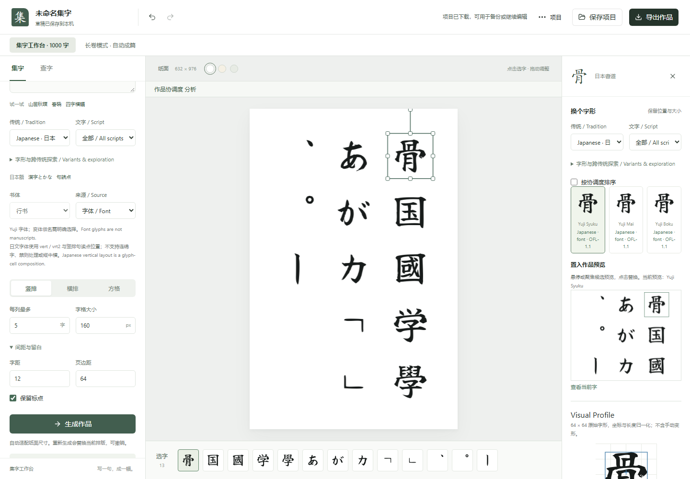

<div align="center">
  

# Calligraphy Studio — East Asian Calligraphy Workbench

Compose, compare and explore Chinese and Japanese calligraphy with an offline-first, provenance-aware workbench.

</div>



<p align="center">
  <a href="https://styayur.github.io/calligraphy-studio/">Live Demo</a> ·
  <a href="https://github.com/styayur/calligraphy-studio/releases/tag/v0.7.1">Download v0.7.1</a> ·
  <a href="docs/ARCHITECTURE.md">Documentation</a>
</p>

## Key features

- **Chinese + Japanese workflows:** choose a writing tradition, browse glyphs and compose horizontally, vertically or on a grid. Strict Chinese/Japanese separation is the default; cross-tradition exploration is an explicit choice.
- **A hands-on workbench:** compose up to 1,000 characters, replace individual glyphs, adjust position, size, rotation and ink, then save a project or export artwork.
- **Visual Profile:** compare shape, ink density, balance and spacing, rank candidates against their context and preview replacements in your composition. Similarity scores support comparison; they do not judge artistic quality.
- **Long-roll composition:** arrange up to 20,000 characters across pages, vary repeated characters where alternatives exist, inspect missing glyphs and export a page ZIP with source records.
- **Offline-first:** bundled fonts, samples and licence texts work locally in Windows, Web and Android builds. No account or cloud service is required for editing.
- **Sources stay attached:** inspect provenance and rights, and retain attribution and applicable licences in project and historical-artwork exports.

## Japanese support

Use **Yuji Syuku, Mai and Boku** as the primary modern Japanese calligraphy sources. **Klee One** adds an independent handwriting candidate for kanji; a small Japanese **Source Han Serif JP derived subset** covers characters absent from both families and is clearly labelled as a coverage fallback. **Yuji Akari and Akebono** provide explicitly selected hentaigana variants. These are contemporary fonts, not historical manuscript originals. In v0.7.1, the measured JIS X 0213 Kanji cmap coverage rises from 6,745/10,051 with Yuji alone to 10,051/10,051 with the combined Japanese library; this does not establish complete typography, IVS support or visual correctness.

HarfBuzz-based shaping supports Japanese font features and glyph-cell composition, including vertical alternates and punctuation placement. Strict Japanese mode uses only Japanese sources. The workbench preserves the distinction between a character's identity and its visual variant. See the [reproducible coverage benchmark](docs/JAPANESE_COVERAGE.md) and [known limitations](#known-limitations).

## Historical glyph sources

The offline bundle includes **20 CODH Kuzushiji v2 historical crops** from *ぢぐち*, with source references and attributed ink-mask derivatives under **CC BY-SA 4.0**. They offer a small, inspectable sample, not comprehensive kuzushiji coverage. A larger verified corpus can be imported through the optional local API.

Chinese workflows retain NCCU cursive samples, three Chinese fonts and structural fallback data. [Explore data sources and optional imports](docs/DATA_SOURCES.md).

## How to use

1. Choose **Chinese** or **Japanese**, enter your text and select the source and layout.
2. Generate a composition. Select a glyph to compare candidates, inspect its source and preview a replacement.
3. Adjust the artwork, using Visual Profile when you want a closer comparison.
4. Save the project JSON for continued editing, or export artwork. Use **Long-roll mode** for longer texts and paged output.

Drafts and caches stay on the current device. Export project files for backups or transfers. **Long-roll results last only for the current session; export the ZIP before refreshing.**

## Download / installation

| Platform | v0.7.1 download | Use |
| --- | --- | --- |
| Windows x64 | [Installer](https://github.com/styayur/calligraphy-studio/releases/download/v0.7.1/CalligraphyStudio-Setup-0.7.1-x64.exe) | Install and launch from the Start menu |
| Windows x64 | [Portable](https://github.com/styayur/calligraphy-studio/releases/download/v0.7.1/CalligraphyStudio-Portable-0.7.1-x64.exe) | Run without installation |
| Web | [Offline ZIP](https://github.com/styayur/calligraphy-studio/releases/download/v0.7.1/CalligraphyStudio-Web-0.7.1.zip) | Extract and serve locally |
| Android | [APK](https://github.com/styayur/calligraphy-studio/releases/download/v0.7.1/CalligraphyStudio-Android-0.7.1.apk) | Install a production-signed APK on Android 7.0+ |

Check downloads against [SHA256SUMS.txt](https://github.com/styayur/calligraphy-studio/releases/download/v0.7.1/SHA256SUMS.txt). On Windows, use `Get-FileHash <file> -Algorithm SHA256`.

**Windows packages are unsigned** and may trigger SmartScreen or organisational restrictions. The Android APK uses the persistent v0.7.1 release signing key; physical-device storage, sharing and lifecycle checks remain outstanding. [Signing and recovery](docs/RELEASE_SIGNING_0.7.1.md).

For the offline Web ZIP, run `python -m http.server 8080` inside the extracted folder, then open `http://localhost:8080`. Keep all bundled directories together. Use HTTP rather than double-clicking `index.html`; no internet connection is needed once the bundle is downloaded.

Back up projects before upgrading. Older clients may discard v2 project fields when resaving; see [migration guidance](docs/MIGRATIONS.md).

## Architecture overview

The shared React/TypeScript canvas workbench runs in the browser, Electron on Windows and Capacitor on Android. The optional FastAPI/SQLite service adds local corpus import and search; downloaded offline packages do not require it.

Japanese shaping uses bundled HarfBuzz WASM in the clients and HarfBuzz/FreeType in the API. Versioned project schemas separate semantic identity, visual variants, source context and rights. Checksummed asset manifests and offline notices keep those records consistent across packages.

[Architecture](docs/ARCHITECTURE.md) · [Japanese glyph model](docs/JAPANESE_GLYPH_MODEL.md) · [Visual Profile](docs/visual-profiles.md)

## Data sources and licensing

| Content | Source / licence |
| --- | --- |
| Chinese fonts | Ma Shan Zheng, Zhi Mang Xing, Liu Jian Mao Cao · SIL OFL 1.1 |
| Japanese fonts | Yuji, Klee One and a renamed Source Han Serif JP coverage subset · SIL OFL 1.1 |
| Historical Japanese sample | CODH Kuzushiji v2 · CC BY-SA 4.0; attributed crops and derivatives |
| Chinese cursive samples | NCCU Cursive Chinese Calligraphy Dataset · MIT |
| Structural fallback data | Hanzi Writer · ARPHIC PUBLIC LICENSE |

Fonts, images, datasets and software retain their own licences. Historical exports carry attribution and share-alike information where applicable. Restricted MCCD/HCSU datasets and the full CODH corpus are not bundled. Unknown historical facts remain unknown.

[Third-party notices](third_party/NOTICE.md) · [Font licences](docs/FONT_LICENSES.md) · [Asset policy](docs/asset-policy.md)

## Development

Use Node.js 22+; the optional API needs Python 3.11+.

```sh
git clone https://github.com/styayur/calligraphy-studio.git
cd calligraphy-studio/apps/web
npm ci
npm run dev -- --mode desktop
```

Run `npm run typecheck`, `npm run test:visual` and `npm run build:desktop` in `apps/web`. For the API, install `apps/api/requirements.txt` and `requirements-dev.txt`, then run `python -m pytest -q` from `apps/api`.

[Contributing](CONTRIBUTING.md) · [Release notes](release/RELEASE_NOTES_0.7.1.md) · [Dependency audit](docs/DEPENDENCY_AUDIT_0.7.0.md) · [Security reporting](SECURITY.md)

## Known limitations

- Japanese composition uses individual glyph cells. Full kinsoku, connected-kana continuity, tate-chū-yoko, arbitrary IVS and complete mixed-script vertical orientation are not implemented.
- The historical sample and orthographic mappings are limited. Font appearance is not evidence of historical authenticity; Korean is not supported.
- The interface is primarily Chinese, with English and key Japanese terms rather than a complete translation.
- Large export ZIPs are assembled in memory; font rendering can vary across platforms. Long-roll mode provides page composition rather than individual glyph dragging.
- Windows installer/upgrade/IME acceptance and physical Android storage, sharing and lifecycle tests remain unverified. Automated Windows renderer tests do not replace those checks.
- Five reviewed development-tooling dependency warnings remain; production dependency audits are clean in the release review.

## Roadmap

Broader reviewed Japanese mappings and vertical layout coverage; easier local corpus installation; native-device export validation; and additional composition presets and tablet input.

## Licence

Application code is [MIT](LICENSE). Third-party fonts, images, data and software remain subject to their individual licences. Thank you to the font designers, dataset maintainers and researchers whose work makes the studio possible.
