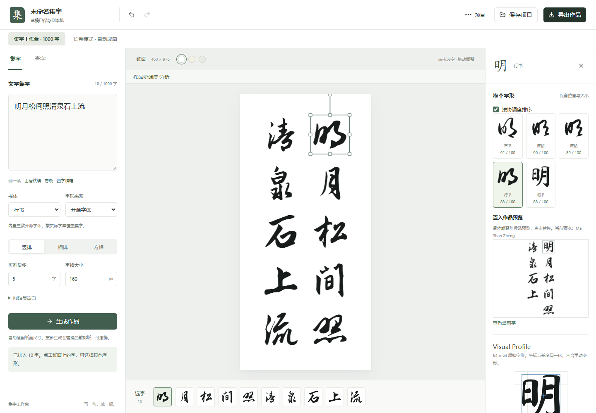
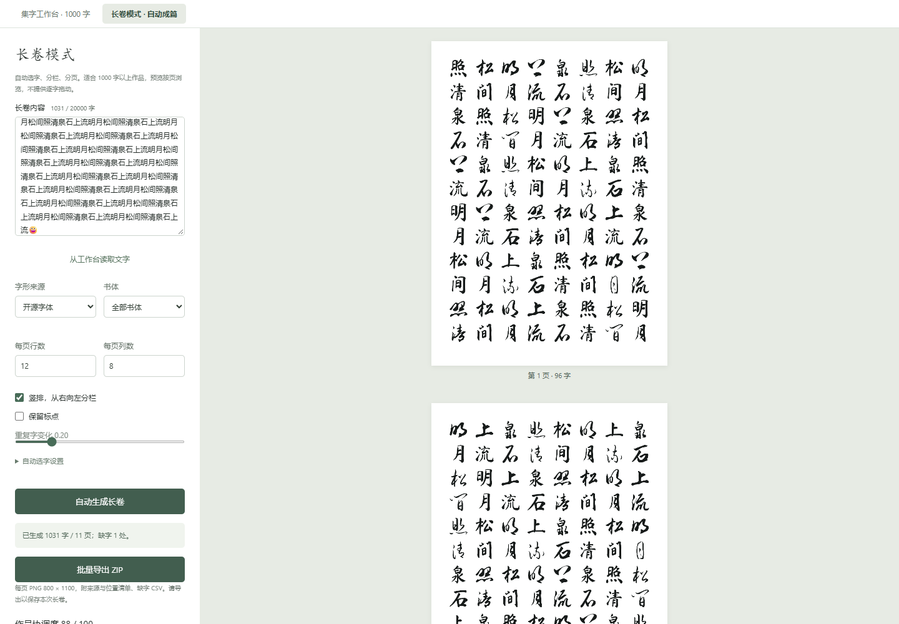

<div align="center">


# Calligraphy Studio

**Chinese calligraphy glyph selection, comparison and composition.**

**Status:** 🟢 Production

[Live Demo](https://styayur.github.io/calligraphy-studio/) · [Download](https://github.com/styayur/calligraphy-studio/releases/latest) · [Documentation](docs/architecture.md) · [Releases](https://github.com/styayur/calligraphy-studio/releases) · [Discussions](https://github.com/styayur/calligraphy-studio/discussions)

[](https://github.com/styayur/calligraphy-studio/releases/latest)
[](https://github.com/styayur/calligraphy-studio/actions/workflows/ci.yml)
[](LICENSE)
[]()
[]()
[]()



</div>

## 目录

- [功能](#功能)
- [下载与安装](#下载与安装)
- [使用指南](#使用指南)
- [快速开始](#快速开始)
- [视觉分析](#视觉分析)
- [开发与测试](#开发与测试)
- [项目结构](#项目结构)
- [参与贡献](#参与贡献)
- [许可证与致谢](#许可证与致谢)

## 功能

| 功能 | 说明 |
| --- | --- |
| **千字工作台** | 最多 1000 字；横排、竖排、方格；单字替换、移动、缩放、旋转、墨色与图层调整 |
| **Visual Profile** | 包围盒、宽高比、墨量、重心、图像矩、投影、象限密度、留白、距离变换、骨架与方向分布 |
| **字形比较** | Context Profile、作品协调度、候选排序、可解释差异面板与置入作品预览 |
| **长卷模式** | 最多 20000 字；自动选字、重复字变化、分页分栏、异常字检测与缺字清单 |
| **批量导出** | 工作台 PNG / 项目 JSON；长卷 ZIP 含逐页 PNG、字形来源与位置清单、缺字 CSV |
| **按需计算** | 候选分页、图片懒加载、Web Worker、IndexedDB 特征缓存、局部重算与虚拟化浏览 |
| **离线使用** | Windows、Android 与网页离线包内置楷、行、草三款 OFL 字体，各覆盖 7015 个字符 |
| **原帖字库** | NCCU 草书样本自动净底；可通过本地 API 扩展字库，保留来源和授权信息 |

### 长卷预览



长卷按页浏览，专注自动生成与批量输出，不提供逐字拖动。小幅精修请使用集字工作台。

## 下载与安装

当前版本：**v0.6.0**。

| 平台 | 下载 | 运行方式 |
| --- | --- | --- |
| Windows x64 | [安装版](https://github.com/styayur/calligraphy-studio/releases/download/v0.6.0/CalligraphyStudio-Setup-0.6.0-x64.exe) | 安装后从桌面或开始菜单打开 |
| Windows x64 | [便携版](https://github.com/styayur/calligraphy-studio/releases/download/v0.6.0/CalligraphyStudio-Portable-0.6.0-x64.exe) | 下载后直接运行 |
| Android 7.0+ | [APK](https://github.com/styayur/calligraphy-studio/releases/download/v0.6.0/CalligraphyStudio-Android-0.6.0.apk) | 安装预览版应用 |
| 浏览器 | [网页离线包](https://github.com/styayur/calligraphy-studio/releases/download/v0.6.0/CalligraphyStudio-Web-0.6.0.zip) | 解压后启动本地 HTTP 服务 |

所有发行包自带字库，无需启动 API。通过 [SHA256SUMS.txt](https://github.com/styayur/calligraphy-studio/releases/download/v0.6.0/SHA256SUMS.txt) 校验下载文件；Windows 可运行 `Get-FileHash 文件路径 -Algorithm SHA256`。

Windows 安装包未使用商业代码签名；Android 使用 debug 预览签名，原生分享尚未经过物理设备验证。升级 Android 若遇到签名不兼容，请先导出作品备份，再卸载旧版安装。

<details>
<summary>网页离线包怎么运行？</summary>

解压并保留 `fonts/`、`demo/`、`assets/` 目录，在解压目录运行：

```shell
python -m http.server 8080
```

打开 `http://localhost:8080`。不要直接双击 `index.html`：字体请求、Worker 和本机存储需要 HTTP 环境。字库随包分发，运行时不需要联网。

</details>

## 使用指南

### 集字与逐字调整

1. 输入文字，选择书体与字形来源。
2. 选择横排、竖排或方格，设置每行 / 列字数、字格、间距和留白。
3. 点击“生成作品”，缺字会保留位置并提示。
4. 点击纸面或底部选字条，查看同字候选。勾选“按协调度排序”；悬停或聚焦候选预览，点击替换。
5. 展开 Visual Profile 与差异面板；点击“作品协调度”按需分析整幅作品。
6. 保存项目 JSON 以便继续编辑，或导出 PNG（原尺寸 / 2 倍尺寸、纸色 / 透明背景）。

### 千字长卷

切换“长卷模式”，输入长文，设置行列数与重复字变化，点击“自动生成长卷”。可浏览各页、查看异常字和缺字位置，再批量导出 ZIP。任务支持取消；取消后保留上一次成功结果。

**长卷生成结果仅保留在当前会话，刷新前请导出 ZIP。** 工作台草稿和特征缓存保存在当前浏览器的本机存储中，不会云端同步。长期保存或跨设备编辑请下载项目文件。

<details>
<summary>工作台快捷键</summary>

| 操作 | 快捷键 |
| --- | --- |
| 撤销 | Ctrl / Command + Z |
| 重做 | Ctrl / Command + Shift + Z，或 Ctrl + Y |
| 复制选中字形 | Ctrl / Command + D |
| 删除 | Delete / Backspace |
| 移动 | 方向键；Shift 加速 |
| 取消选择 | Escape |

</details>

## 快速开始

需要 **Node.js 22+**。静态模式不需要 Python 或 API。

```shell
git clone https://github.com/styayur/calligraphy-studio.git
cd calligraphy-studio/apps/web
npm ci
npm run dev -- --mode desktop
```

打开终端显示的本地地址，默认 `http://localhost:5173`。

```shell
npm run build:pages    # GitHub Pages 子路径
npm run build:desktop  # 桌面端与离线网页资源
npm run build:android  # Android 资源
```

<details>
<summary>扩展本地字库与 API（Python 3.11+）</summary>

从仓库根目录运行：

```powershell
cd apps/api
python -m venv .venv
.venv/Scripts/python -m pip install -r requirements.txt
.venv/Scripts/python -m uvicorn app.main:app --reload --port 8000
```

macOS / Linux 将 `.venv/Scripts/python` 改为 `.venv/bin/python`。另开终端，在 `apps/web` 执行 `npm run dev`，连接本地 `/api` 和 `/assets`。API 文档位于 `http://127.0.0.1:8000/docs`。

- [MCCD 与清单导入](docs/MCCD_IMPORT.md)
- [字体导入与授权](docs/FONT_LICENSES.md)
- [数据源说明](docs/DATA_SOURCES.md)
- [字体导入清单](samples/fonts/manifest.json)

MCCD/HCSU 等受限数据不随公开包分发，使用时遵循数据自身的授权条件。

</details>

## 视觉分析

特征在保持比例的 64×64 图像上计算。比较使用墨量、形状和结构差异；协调度表示字形与上下文的相近程度，**不代表审美优劣**。当前不计入工作台手动变形和墨色设置。

实验面板提供投影 **1D Optimal Transport**、连通分量 / 孔洞拓扑及灰度过滤 **H0 persistent homology**。这些指标不参与默认排序；尚未实现完整 2D OT、H1 持久性或基于人工偏好验证的审美模型。

长卷使用有界 beam search，结合上下文、相邻字差异和重复惩罚；不保证全局最优。每个不同字最多分析 8 个候选，只有一种候选时不会伪造字形变化。

算法定义、文献映射、缓存策略和本机性能测量见 [视觉分析实现说明](docs/visual-profiles.md)。参考研究：[Yoshida et al., 2025](https://doi.org/10.1587/transfun.2024SML0003)；[Fu et al., 2024](https://doi.org/10.3233/FAIA231510)。

## 开发与测试

```shell
# apps/web
npm run typecheck
npm run test:visual
npm run build:desktop
```

浏览器回归在仓库根目录执行，先启动静态服务：

```shell
python -m pip install playwright pillow
python -m playwright install chromium
python -m http.server 5178 --directory apps/web/dist
```

在另一个终端运行：

```shell
python scripts/test_studio_browser.py --url http://127.0.0.1:5178
python scripts/test_visual_browser.py --url http://127.0.0.1:5178 --built
```

Windows 可使用已安装的 Edge，为测试命令添加 `--channel msedge`。测试涵盖排版与历史记录、草稿恢复、PNG 尺寸和透明度、原帖净底、特征数值、缓存、1000 字边界、长卷分页、重复变化、缺字、取消、ZIP 完整性和手机布局。

推送 `main` 后自动部署 [GitHub Pages](.github/workflows/pages.yml)。推送版本标签后，[Release workflow](.github/workflows/release-all.yml) 从同一提交构建 Windows、Android、Web，测试通过后发布附件与 SHA-256 清单。

## 资产来源与仓库边界

核心领域、UI、平台、持久化、资产与发布边界见 [架构文档](docs/ARCHITECTURE.md)。第三方字体、原帖样本和结构数据的来源、许可证与 SHA-256 记录见 [资产政策](docs/asset-policy.md) 和 [字体 provenance](samples/fonts/provenance.json)。运行数据库、导入缓存、`storage/assets/`、`work/` 与平台构建产物均为 generated/runtime 内容，不提交到源码分支。新增字库或数据前必须确认再分发、修改和商业使用权利。

## 项目结构

```text
apps/
  web/          React + TypeScript + Konva；Android 容器
  desktop/      Electron 桌面端
  api/          FastAPI + SQLite；字库导入与检索
samples/        字形样本、原字体与许可证
scripts/        数据工具、字库打包、浏览器回归
docs/           实现说明、数据来源、授权与截图
release/        发行说明与离线包使用指南
third_party/    第三方声明
```

## 参与贡献

欢迎通过 [Issues](https://github.com/styayur/calligraphy-studio/issues) 提交问题和建议。问题报告请注明版本、平台、复现步骤，并附可公开的示例文字或截图。

提交 Pull Request 前请运行类型检查、相关测试及构建。新增字库需保留来源与许可证；算法修改请同步更新特征版本和 [实现说明](docs/visual-profiles.md)。

## Roadmap

### Current

- Glyph selection, long-scroll composition, visual comparison, and export.
- Web, Windows, and Android builds with OFL font provenance.

### Next

- Expand the font pack with recorded provenance and checksums.
- Strengthen visual-comparison and layout tools.

### Future

- More composition presets and tablet/pen input.

### Not planned

- Auto-generated calligraphy that imitates a specific master's hand.
- Cloud accounts or sync; the studio is offline.

## 社区与治理

- GitHub Issues：可复现 bug 与范围明确的功能请求。
- Discord：[加入社区](https://discord.gg/wA2xy6VPK)，用于快速交流、设计讨论和早期反馈；不是 SLA 支持渠道。
- Security：按 [SECURITY.md](SECURITY.md) 私下报告，不要开公开 Issue。
- Contributing：开发、测试、资产准入与发行边界见 [CONTRIBUTING.md](CONTRIBUTING.md)。
- Release：使用 `vX.Y.Z` tag，由 Release workflow 从同一提交构建 Windows、Android、Web，附件包含 SHA-256 清单；维护者负责发布。

## 许可证与致谢

代码采用 [MIT License](LICENSE)。字体、图片和结构数据分别遵循各自许可证。

| 内容 | 来源与许可证 |
| --- | --- |
| 楷书字体 | Ma Shan Zheng · SIL OFL 1.1 |
| 行书字体 | Zhi Mang Xing · SIL OFL 1.1 |
| 草书字体 | Liu Jian Mao Cao · SIL OFL 1.1 |
| 草书原帖样本 | NCCU Cursive Chinese Calligraphy Dataset · MIT |
| 结构替补数据 | Hanzi Writer · ARPHIC PUBLIC LICENSE |

感谢开放字体、数据集及相关研究的作者。完整授权说明见 [第三方声明](third_party/NOTICE.md) 和 [字体授权](docs/FONT_LICENSES.md)。公开原帖仅含样本，字体字形不等同于历史书家原迹；生僻字覆盖以实际字库为准。
