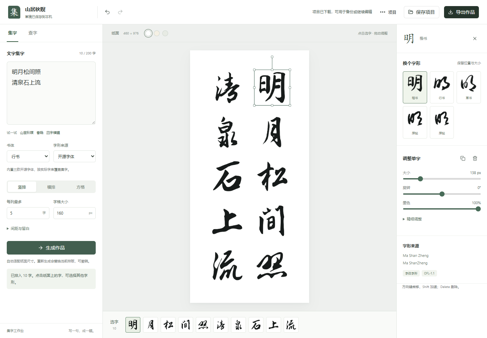

# Calligraphy Studio · 集字工作台

输入喜欢的文字，挑选字形，排成一幅可以保存、继续编辑和导出的书法作品。

[在线使用](https://styayur.github.io/calligraphy-studio/) · [下载 v0.5.0](https://github.com/styayur/calligraphy-studio/releases/tag/v0.5.0) · [更新说明](release/RELEASE_NOTES.md)



## 下载与安装

| 平台 | 下载 | 使用方式 |
| --- | --- | --- |
| Windows x64 安装版 | [Setup 0.5.0](https://github.com/styayur/calligraphy-studio/releases/download/v0.5.0/CalligraphyStudio-Setup-0.5.0-x64.exe) | 安装后从桌面或开始菜单打开 |
| Windows x64 便携版 | [Portable 0.5.0](https://github.com/styayur/calligraphy-studio/releases/download/v0.5.0/CalligraphyStudio-Portable-0.5.0-x64.exe) | 下载后直接运行 |
| Android 7.0+ | [APK 0.5.0](https://github.com/styayur/calligraphy-studio/releases/download/v0.5.0/CalligraphyStudio-Android-0.5.0.apk) | 允许对应浏览器或文件管理器安装应用 |
| 网页离线包 | [Web 0.5.0 ZIP](https://github.com/styayur/calligraphy-studio/releases/download/v0.5.0/CalligraphyStudio-Web-0.5.0.zip) | 解压后启动本地 HTTP 服务，见包内 README |

安装包包含字库，不需要启动 API。Release 附带 [SHA256SUMS.txt](https://github.com/styayur/calligraphy-studio/releases/download/v0.5.0/SHA256SUMS.txt)，可用 PowerShell `Get-FileHash 文件路径 -Algorithm SHA256` 校验。

Windows 安装包尚未使用商业代码签名；Android 使用 debug 预览签名，不是应用商店发行包。Android 旧版遇到签名不兼容时，请先导出项目备份，再卸载旧版并安装新版。

## 开始集字

1. **输入文字**：在“集字”页输入一段文字，换行分句，也可以选用内置示例。
2. **选择字形**：选择楷书、行书或草书，以及开源字体或原帖字库。
3. **生成作品**：选择竖排、横排或方格，调整每行/列字数、字格大小、间距和留白。纸面自动适配，竖排从右向左排列。
4. **逐字打磨**：点击纸面或底部选字条，替换同一个字的其他字形，拖动位置，调整大小、旋转和墨色。精细调整中保留倾斜、混合模式和图层顺序。
5. **保存与导出**：保存项目 JSON 便于继续编辑；导出原尺寸或 2 倍尺寸 PNG，可选纸色或透明背景。

Android 的导出使用系统“保存或分享”面板，选择文件管理器或目标应用完成保存。手机通过“文字与字库 / 作品预览”切换工作区。

## v0.5.0 带来了什么

- 三款完整的内置开源字体各覆盖 **7,015 个字符**，在浏览器按需生成透明字形，不再局限于少量预导出样本。
- 竖排、横排和方格自动计算纸面，缺字保留位置并明确提示。
- 同字候选一键替换，保留位置、大小和变换；支持复制、删除、撤销与重做。
- NCCU 黑底白字原帖自动净底为透明墨迹，同时保留来源、授权和处理标记。
- 输入文字和作品草稿在本机恢复；项目文件保留名称、字形来源、排版参数和作品内容。
- 白色工具栏、浅灰工作区和独立纸面，单字调整按需出现，适配手机宽度。

## 保存、快捷键与使用边界

作品草稿保存在当前浏览器或应用的本机存储中，**不是云同步**。等待“草稿已保存到本机”后可刷新恢复；清理浏览器数据、卸载应用或更换访问地址可能失去该草稿。长期保留或跨设备编辑请下载项目 JSON。

| 操作 | 快捷键 |
| --- | --- |
| 撤销 | Ctrl / Command + Z |
| 重做 | Ctrl / Command + Shift + Z，或 Ctrl + Y |
| 复制选中字形 | Ctrl / Command + D |
| 删除选中字形 | Delete / Backspace |
| 移动选中字形 | 方向键；按住 Shift 每次移动 10 px |
| 取消选择 | Escape |

- 单幅文本最多 200 字；重新生成会替换当前排版，可撤销。
- 字体覆盖以实际字符表为准，生僻字可能缺失；字体字形不代表历史书家原迹。
- 原帖覆盖取决于已收录或自行导入的字库。公开版含 30 张 NCCU 草书样本，不是完整碑帖数据库。
- PNG 清晰度受原始图片分辨率限制，2 倍导出不会恢复低清原帖中缺失的细节。
- 当前未提供 AI 生成字形、云端同步和原帖自动识别裁字。

## 本地运行

需要 Node.js 22+。只使用内置字体与静态原帖时，不需要 Python 或 API。

```powershell
git clone https://github.com/styayur/calligraphy-studio.git
cd calligraphy-studio/apps/web
npm ci
npm run dev -- --mode desktop
```

打开终端显示的地址，默认是 `http://localhost:5173`。

构建静态站点或客户端资源：

```powershell
npm run build:pages    # GitHub Pages 子路径
npm run build:desktop  # 相对路径离线资源
npm run build:android  # Android 资源
```

### 扩展本地字库与 API

需要 Python 3.11+，先从仓库根目录启动 API：

```powershell
cd apps/api
python -m venv .venv
.venv/Scripts/python -m pip install -r requirements.txt
.venv/Scripts/python -m uvicorn app.main:app --reload --port 8000
```

另开终端，在 `apps/web` 运行 `npm run dev`，连接 `/api` 和 `/assets`。服务提供 Glyph 查询、书家/书体筛选、项目存储、视觉相似检索和结构替补接口，API 文档位于 `http://127.0.0.1:8000/docs`。

- [MCCD 与清单导入](docs/MCCD_IMPORT.md)
- [字体导入与授权](docs/FONT_LICENSES.md)
- [数据源说明](docs/DATA_SOURCES.md)
- [功能阶段与边界](docs/PHASE_GATES.md)
- [字体导入清单](samples/fonts/manifest.json)

MCCD/HCSU 等受限数据不随公开包分发。导入及使用前请核对数据自身的授权条件。

## 开发验证与发布

```powershell
# apps/web
npm run typecheck
npm run build:pages

# 仓库根目录；先保持网页开发服务运行
python -m pip install playwright pillow
python scripts/test_studio_browser.py --url http://127.0.0.1:5173 --channel msedge
```

其他系统可先运行 `python -m playwright install chromium`，再省略 `--channel msedge`。浏览器回归涵盖实际纸面选字、同字替换、排版边界、缺字留位、输入/作品恢复、PNG 像素与透明度、JSON 导入、原帖净底、搜索和手机布局。

重新打包浏览器字库：`python scripts/build_browser_fonts.py`，需要 `fonttools brotli`。原字体在 `samples/fonts/`，浏览器资源在 `apps/web/public/fonts/`，字符覆盖直接从字体 cmap 生成。

推送 `main` 后自动部署 GitHub Pages。发布时同步修改 Web/Desktop 版本及 Android `versionName` / `versionCode`，推送 `vX.Y.Z` 标签；[Release workflow](.github/workflows/release-all.yml) 校验版本，从同一提交构建 Windows、Android 和 Web，浏览器回归通过后发布附件与统一 SHA-256 清单。也可手动为现有标签重跑。

## 目录

```text
apps/web/       React + Konva 集字工作台及 Android 容器
apps/desktop/   Electron 桌面端
apps/api/       FastAPI + SQLite、字库导入与检索
samples/        演示字形、草书样本、原字体与许可证
scripts/        数据工具、字库打包和浏览器回归
release/        发行说明和离线网页使用说明
docs/           数据源、授权和导入文档
```

## 授权

代码采用 [MIT License](LICENSE)。第三方字体、图片和结构数据遵循各自许可证，不自动继承代码许可。

| 内容 | 来源与许可证 |
| --- | --- |
| 楷书字体 | Ma Shan Zheng，SIL OFL 1.1 |
| 行书字体 | Zhi Mang Xing，SIL OFL 1.1 |
| 草书字体 | Liu Jian Mao Cao，SIL OFL 1.1 |
| 草书原帖样本 | NCCU Cursive Chinese Calligraphy Dataset，MIT |
| 结构替补数据 | Hanzi Writer / ARPHIC PUBLIC LICENSE |

完整说明见 [第三方声明](third_party/NOTICE.md) 和 [字体授权文档](docs/FONT_LICENSES.md)。发行包保留 `demo/licenses/` 中的字体许可证。
