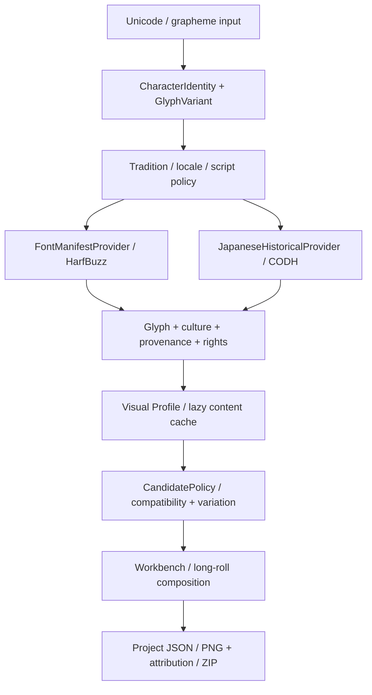

# East Asian Calligraphy Workbench — 0.7.0 delivery report

Verified locally on Windows on 2026-10-05. This is an implementation in the existing React/Konva, Electron, Capacitor and FastAPI architecture. Japanese is the first expansion beyond Chinese. No release has been published or existing release overwritten.

**The 2026-10-06 [release-readiness section](#v070-release-readiness) supersedes the baseline dependency status, test totals, package sizes and hashes below.** Sections 1–15 preserve the original implementation record.

## 1. Architecture changes

Semantic identity, visual variants, cultural metadata, rights and candidate policy are domain records shared by providers, search, composition and export. Chinese providers, source assets, Visual Profile, worker/cache infrastructure, project transforms and long-roll architecture are retained.



Japanese browser rendering is fully package-local. Optional large corpora use the local API and asset store. No cloud account, mandatory network call, speculative ML module or generative imitation was introduced.

## 2. Model and schema migrations

- `Glyph.character` remains plain text. `identity` preserves exact text, codepoints, script, language, locale and optional canonical relationship. `variant` separately identifies a source occurrence or font outline, variant type, glyph ID and glyph name.
- Project schema 1 loads and migrates to 2 without discarding existing IDs, transforms, canvas or provenance. Version 2 persists policy and per-glyph rights/source/shaping metadata. Future project/database schemas are rejected.
- Database schema 1 → 2 is explicit and transactional on SQLite: add/backfill cultural and identity columns, replace old uniqueness with `(identity_key, source_id, checksum)`, preserve IDs, foreign keys and embedding references. Migration is idempotent and tested against a legacy database. PostgreSQL ALTER support is implemented but not integration-tested.
- The identity key includes Unicode sequence, language/locale/script, tradition and variant. Same Unicode, same bitmap, different cultural identities or variants can coexist. Named existing Chinese providers retain their verified provider-level facts; unknown regional locale stays null.
- Existing API character searches and provenance values (`original`, `font`, `fallback`, `generated`) remain. New filters are optional; metadata defaults to Chinese for older clients.

See [migration instructions](MIGRATIONS.md) and [Japanese glyph model](JAPANESE_GLYPH_MODEL.md). Back up the database before upgrading; downgrading requires restoring that backup.

## 3–5. Japanese sources, exact revisions and redistribution decisions

### Yuji fonts

All five fonts are bundled from the [official Yuji repository](https://github.com/Kinutafontfactory/Yuji/tree/efec977b14b57c19eb85d468edcfbbad13139e67), commit **`efec977b14b57c19eb85d468edcfbbad13139e67`**, internal version **3.002**. Designer: **Yuji Kataoka / Kinuta Font Factory**. Copyright: 2021 The Yuji Project Authors. Licence: **SIL OFL 1.1**, independently included; provenance is always `font`.

| Font | Original TTF SHA-256 |
| --- | --- |
| Yuji Syuku | `82728ebafc8c97391e2dab633414a806f344b8e4e2227d307179f07b548fca61` |
| Yuji Mai | `05d83b65204a5de6fc34c222057fc082f8c6e2e44c05a0d28f4189b3e54c54c2` |
| Yuji Boku | `94fda16384f3bdac24376a000c57e99abfa314961bd89ef27badfb7410322003` |
| Yuji Akari | `6fa6bfaff8851fd20f32a807dfb9a7dc15f54780af564ddc8f32e074004bde27` |
| Yuji Akebono | `8e387eeb5c24cd2945d8804caab8f97985b694cec8d2b228da63cceb16c7a8f3` |

Syuku/Mai/Boku each advertise 8,013 mapped codepoints; Akari/Akebono each 336. Coverage is manifest-driven, not a promise that every Japanese sequence is supported. Original Chinese font files and their 7,015-codepoint runtime coverage are retained.

Akari/Akebono historical kana outlines encoded at modern hiragana codepoints retain the exact typed semantic text and a distinct `hentaigana` visual variant. Non-kana outlines in those fonts are `font-alternate`. These historical-kana packs are excluded from strict default selection unless explicitly requested. They are fonts, not manuscript originals.

### CODH historical sample

Reviewed authoritative source: [CODH / ROIS character shapes](https://codh.rois.ac.jp/char-shape/), **v2, 2019-11-11**, DOI [10.20676/00000340](https://doi.org/10.20676/00000340), **CC BY-SA 4.0**. Attribution: **日本古典籍くずし字データセット (国文研所蔵／CODH加工)**.

Bundled: **20 display crops** from book **200006663, ぢぐち**, and explicitly marked normalized transparent derivatives. [Official archive](https://codh.rois.ac.jp/char-shape/dataset/v2/200006663.zip) SHA-256: **`3e47c4f1f4b12dec83732dad8e398780851751bd225114395d420857d2bb3671`**. Original crop checksum, source occurrence, page, bounding box, transcription, source URI, attribution and derivative checksum survive import/export. Unavailable language, locale, period and author remain null. Japanese collection/tradition does not imply the language of every text.

CC BY-SA images and derivatives remain outside the MIT code licence. No KMNIST, Kuzushiji-49/Kanji, Kaggle mirror or unofficial reupload is used as a production asset library. The sample does not represent all Japanese calligraphy; CODH modernized transcriptions do not recover every historical semantic distinction.

### Shaping software

- Python: **uharfbuzz 0.56.2** and **freetype-py 2.5.1**, pinned requirements; fontTools inspects coverage/names. Original Chinese rendering is retained.
- Browser: **harfbuzzjs 1.6.2**, npm gitHead **`b2ec00c97159ee8aa563691792aa3081adbc8a50`**, corresponding HarfBuzz submodule **`863d3f7787c6df18d20e4535c5906bf3eb803bd5`**. Wrapper MIT and engine Old MIT licence texts and checksums are independently bundled.

## 6. UI changes

Existing visual language and editing surface remain. Reusable controls add Chinese/Japanese tradition, Unicode script and conservative candidate mode. Advanced controls expose language, locale, variant, period, work, designer/calligrapher and commercial suitability. Labels include English alongside Chinese/Japanese terminology.

Candidate cards identify tradition, provenance and licence compactly. Inspector details expose semantic text/codepoints, variant, source/work/creator, culture, source URI, source/font/asset checksums and licence. Expanded metadata stays out of the canvas. The Japanese screenshot in README is captured from the tested production bundle.

## 7. Search and ranking

Search supports character, source/provenance, tradition, language, locale, script, variant, period, work, creator and commercial suitability. Indexed API queries are paginated; images and fonts remain lazy.

Modes: **Strict tradition** (default), **Related variants**, **Cross-tradition exploration**. Tradition mismatches and known locale mismatches are hard exclusions in conservative modes; cross-tradition inclusion requires explicit opt-in. Shared Han codepoints do not bypass these boundaries. Unknown cultural provenance is not guessed.

Both runtimes expose tested configurable cost weights: visual `.55`, locale `.12`, tradition `.12`, script `.08`, period `.05`, work `.05`, repetition `1`. Lower cost ranks first; penalties and hard filters replace a visual-only decision. Source/work consistency and repeated-glyph variation participate in the existing composition search. Original Chinese repetition behavior is regression-tested.

## 8. Japanese shaping and composition

Exact Unicode grapheme → explicit script/language → HarfBuzz (`locl`, `vert`, `vrt2` as appropriate) → positioned glyph IDs/names → raster asset. Python uses FreeType; browser uses HarfBuzz outline paths and Canvas. Metadata retains original sequence, direction, features, engine, font version/commit, glyph IDs/names, locale/script and font checksum. Japanese is not rendered through a cmap-only approximation. Chinese legacy Pillow/Canvas paths are explicitly identified as not locale-aware shaping.

Horizontal/vertical mixed kanji, hiragana, katakana, decomposed dakuten, repeated kana, Japanese brackets, prolonged sound marks and punctuation are tested. Japanese commas/stops anchor to the upper right in vertical cells and lower left in horizontal cells; applicable font vertical alternates are shaped. Unsupported input remains missing rather than receiving a Chinese structural fallback in a Japanese request.

Visual Profile, projections, moments, whitespace, skeleton, orientation and topology experiments work with Japanese assets. Similarity is a computational signal, not authenticity or aesthetic authority.

## 9. Historical corpus, performance and import security

Three tiers share schema 2: core fonts → lightweight historical sample → optional locally installed corpus. The roughly 7.35 GB upstream full ZIP is excluded from every release. Reproducible official-source downloader and archive importer live in `scripts/import_codh.py`; setup is documented in [DATA_SOURCES.md](DATA_SOURCES.md).

Downloaded archives and manifests are untrusted: validate checksum/schema, paths including Windows traversal, symlinks/encryption, allowed file types, image dimensions, expanded/archive size limits, malformed fonts and unsafe SVG content. Do not extract archives or execute upstream scripts. Stream coordinate records/crops and commit every 100 records; cancellation retains committed checkpoints, and repeated imports deduplicate by source/identity/checksum. The actual official archive was imported twice: 20 records followed by 20 skips.

Raw archives stay in ignored `data/imports/`; source crops/fonts and runtime normalized assets are separate. Content checksums invalidate derived caches. Optional API corpus queries are indexed/paginated. Browser font/image loading is lazy; raster cache is bounded to 2,048 entries. A full corpus is not preloaded into browser memory.

## 10. Tests added

- Python regression suite now **37 passing tests**, preserving the original tests: legacy SQLite/project migrations and future-version rejection; script properties; duplicate Unicode/visual identities; Chinese/Japanese regional separation; strict/related/cross policies; font manifest checksums/coverage/shaping and deterministic rasterization; hentaigana; vertical punctuation; historical metadata and share-alike propagation; commercial-only exclusion and ND composition rejection; importer repeatability, archive traversal/bombs, invalid manifests/fonts/images/SVG.
- TypeScript domain tests cover identity/graphemes, project migration, hentaigana, regional safety, candidate policies/weights, Japanese layout, rights/share-alike and beam policy. Existing geometry/moments/EDT/skeleton/topology/H0/OT, pagination, 1,000-character limit, repetition/cancellation and ZIP tests remain.
- New production Japanese browser regression covers 13 mixed graphemes, exact decomposed input, font glyph IDs, vertical/horizontal punctuation, repeatable bitmaps, opt-in cross-tradition search, Visual Profile, Akari/Akebono variants, all 20 CODH crops, attribution ZIP/licence, persisted project/policy and **1,015-character Japanese long roll** with export. External requests are blocked in this test.
- Actual package validators check canonical receipts, **all 8 fonts**, **all 20 historical assets**, code/third-party notices and independent licence texts inside Windows ASAR, web ZIP and Android APK.

## 11. Build and test results

| Check | Local result |
| --- | --- |
| TypeScript typecheck (application + Vite configuration) | PASS |
| Unit / Visual Profile / East Asian tests | PASS |
| Python API pytest suite | **37 passed**, one existing Starlette/anyio deprecation warning |
| Original Chinese browser regression | PASS, including canvas editing/history/project restore/export/mobile layout |
| Original Visual Profile browser regression | PASS; final local 1,000-char workbench 0.62 s, 1,031-char roll 0.96 s; no page errors |
| New Japanese production browser regression | PASS, including 1,015-char roll and offline local resources |
| Web desktop/static build | PASS |
| GitHub Pages subpath build | PASS |
| Windows NSIS installer + portable | PASS; actual ASAR asset/licence gate PASS |
| Android release APK, Java 21 / Gradle 8.14.3 | PASS; 205 tasks; actual APK asset/licence gate PASS |
| Offline canonical licence/provenance validation | PASS; schema 2, 8 fonts, 20 samples |
| Python compile / workflow YAML parse / whitespace check | PASS |
| Production web npm audit | 0 vulnerabilities |
| Desktop npm audit | 0 vulnerabilities; vulnerable inherited http-cache-semantics updated |

These are actual local builds/tests, not claims that hosted GitHub jobs ran. CI and release workflows now run the relevant suites and package gates. Existing hosted CodeForge workflow is retained; its executable was unavailable locally and that separate hosted check was not run.

## 12. Release size impact and artifacts

Compared with the published v0.6.0 artifacts:

| Artifact | v0.6.0 bytes | Local v0.7.0 bytes | Increase |
| --- | ---: | ---: | ---: |
| Windows setup | 120,659,939 | 136,345,359 | 15,685,420 |
| Windows portable | 120,429,952 | 136,100,924 | 15,670,972 |
| Offline web ZIP | 9,486,470 | 25,158,132 | 15,671,662 |
| Android APK | 12,778,736 | 28,482,053 | 15,703,317 |

Compressed Japanese fonts add **15,285,732 bytes**, sample PNGs **254,495 bytes**, and HarfBuzz WASM **433,772 bytes**. Current public asset tree totals **25,321,591 bytes**. Original Japanese TTFs total **25,644,824 bytes** and are retained for reproducibility, but full historical archives, SDKs, virtual environments and runtime databases are not packaged or tracked.

Japanese files use `.ttf.gzip` because Android AAPT rewrites `.gz` names/content. Actual archive verification caught and fixed that portability issue. All platforms now retain the same paths, font bytes and canonical schema/version receipt. Release workflow refuses to overwrite an existing release.

Artifacts: `apps/desktop/release/CalligraphyStudio-{Setup,Portable}-0.7.0-x64.exe`, `work/CalligraphyStudio-Web-0.7.0.zip`, `work/CalligraphyStudio-Android-0.7.0.apk`. SHA-256 receipt: `work/SHA256SUMS-0.7.0.txt`.

| Artifact | SHA-256 |
| --- | --- |
| Setup | `67803c34716c2b092263a0ac7582f907641b7942fb56678aa9c60f9fc4667fa6` |
| Portable | `da07216b88e4ad0827a3dc04108cee3e5f190bbecbd00eb96184cacf1fb27544` |
| Web | `9690ea824f0c38887662901f82ca1cee76ceff699e60cec6b726b4bab8e0572a` |
| Android | `c967d1d9bab121bfd7dba35f5b1450098d910a6963c6e9dd6baa2ffef925de8f` |

## 13. Known limitations

- Japanese composition remains glyph-cell composition: connected kana, kinsoku, tate-chū-yoko, complete mixed Latin UAX #50 orientation and arbitrary IVS coverage are not implemented. The five reviewed shinjitai/kyūjitai pairs are not a complete dictionary. Chinese simplified/traditional coverage is retained, with no inferred regional locale or full automatic orthographic classification.
- Canvas and FreeType are repeatable in the tested engine; antialiasing is not promised byte-identical between platforms. Fonts do not confer historical authenticity.
- Full corpus import requires the local API/CLI; there is no standalone corpus installation UI. Cancelled imports are repeatable; downloads restart rather than using byte-range resume. Large export ZIPs still assemble in browser memory.
- SQLite migration is tested; PostgreSQL integration is not. Hosted CI/CodeForge and physical Windows/Android runtime sharing/install behavior were not exercised locally. Windows packages are unsigned; Android retains the existing preview/debug signing configuration.
- Full developer npm audit reports **5 high findings** in the inherited Tailwind 3 development dependency chain (braces/chokidar/fast-glob/micromatch/tailwindcss). The registry proposes a breaking Tailwind 4 upgrade; this release retains the established UI/toolchain. Production web and desktop audits have zero findings. This development-toolchain remediation remains open and is not represented as passing.

## 14. Files changed

The complete tracked/new file inventory follows below. It excludes ignored build artifacts, imported ZIPs, local SDK/runtime caches and test work files. Principal changes are domain/migration/provider/service modules, candidate/shaping/rights/frontend controls, deterministic asset scripts and manifests, regression/package validators, all-platform workflows, documentation and independently licensed fonts/crops.

```text
.gitattributes
.github/workflows/ci.yml
.github/workflows/pages.yml
.github/workflows/release-all.yml
.gitignore
README.md
apps/api/app/database.py
apps/api/app/domain.py
apps/api/app/main.py
apps/api/app/migrations.py
apps/api/app/models.py
apps/api/app/orthography.py
apps/api/app/providers/base.py
apps/api/app/providers/codh.py
apps/api/app/providers/font_manifest.py
apps/api/app/providers/hanzi_writer.py
apps/api/app/providers/japanese_historical.py
apps/api/app/providers/mccd.py
apps/api/app/providers/nccu_cursive.py
apps/api/app/routes/compose.py
apps/api/app/routes/glyphs.py
apps/api/app/routes/metadata.py
apps/api/app/routes/search.py
apps/api/app/routes/similarity.py
apps/api/app/schemas.py
apps/api/app/seed.py
apps/api/app/services/batch_service.py
apps/api/app/services/candidate_policy.py
apps/api/app/services/embedding_service.py
apps/api/app/services/font_shaper.py
apps/api/app/services/glyph_importer.py
apps/api/app/services/glyph_service.py
apps/api/app/services/metadata_service.py
apps/api/app/utils/image_meta.py
apps/api/pyproject.toml
apps/api/requirements.txt
apps/api/tests/test_east_asian.py
apps/desktop/package-lock.json
apps/desktop/package.json
apps/web/android/app/build.gradle
apps/web/android/gradle/wrapper/gradle-wrapper.properties
apps/web/package-lock.json
apps/web/package.json
apps/web/public/LICENSE
apps/web/public/THIRD_PARTY_NOTICE.md
apps/web/public/demo/glyphs.json
apps/web/public/fonts/asset-manifest.json
apps/web/public/fonts/catalog.json
apps/web/public/fonts/licenses/OFL-liu-jian-mao-cao.txt
apps/web/public/fonts/licenses/OFL-ma-shan-zheng.txt
apps/web/public/fonts/licenses/OFL-yuji-akari.txt
apps/web/public/fonts/licenses/OFL-yuji-akebono.txt
apps/web/public/fonts/licenses/OFL-yuji-boku.txt
apps/web/public/fonts/licenses/OFL-yuji-mai.txt
apps/web/public/fonts/licenses/OFL-yuji-syuku.txt
apps/web/public/fonts/licenses/OFL-zhi-mang-xing.txt
apps/web/public/fonts/yuji-akari.ttf.gzip
apps/web/public/fonts/yuji-akebono.ttf.gzip
apps/web/public/fonts/yuji-boku.ttf.gzip
apps/web/public/fonts/yuji-mai.ttf.gzip
apps/web/public/fonts/yuji-syuku.ttf.gzip
apps/web/public/japanese/assets/08f1af9369dc16b4a8126734649a14bea7b6265077ddbea3a20575881ba41ba7.png
apps/web/public/japanese/assets/21d719a6e7bc31ee7700440c63bc3466256fd6f98489d0df3deed205ca14313c.png
apps/web/public/japanese/assets/327ce1d4453f737b9181a2a35f703bba2d369a21ffdb2320b42e52434ce2e652.png
apps/web/public/japanese/assets/3d9648ee4e330ef354802c377c50bc9bbf43813be5041af4465bc1ca002016be.png
apps/web/public/japanese/assets/3db827ec356dc8ffd7529a6fa4d43336230c68852308ea25b5f60e463042b973.png
apps/web/public/japanese/assets/5826519bf10b573ffaf79109eaafc8ec3002d71a27a1c0bd2afc1624d540de12.png
apps/web/public/japanese/assets/763235fd471e80cb5e8b17607d29920c24491b19e90f67c10048a9a2ea1ba718.png
apps/web/public/japanese/assets/7780298abae296ea0d6b42f1e886d7f75d4bd5d0d6fc2bd2ab421cf2a8c7658c.png
apps/web/public/japanese/assets/7d30b9e1d7874bb8118107f015808120b3920afdae2593c26b417a025a7ecbd3.png
apps/web/public/japanese/assets/832881ee5c47316994d5a1a48ebe136f5bd3d6eb6e47a5629f5f4456d460525b.png
apps/web/public/japanese/assets/8e51528bf9be217cd7e7a11b1bc270608b5100171674cc04c353a3bf421a5347.png
apps/web/public/japanese/assets/c676da705e6417018096bb9acdb4b26dc0f97e1edc199ccbceca9b3ebd754a48.png
apps/web/public/japanese/assets/c6b361b9b369391b3b68e16c28a9b3acd22d7a0d8e56c298bae9ee602310be53.png
apps/web/public/japanese/assets/d3ed57baa2d5d544bff6be7de7de0e8b26414dd0c987d7de43a34e399d14504d.png
apps/web/public/japanese/assets/d5341decd3d334692570943bf19d01af8bf4cae1b169f8e4ee0221b49c094462.png
apps/web/public/japanese/assets/dc5d78a9a6daafc51e48aff5a3d4a10dff5930ce6ebf8fce2fe022cbfa60bb91.png
apps/web/public/japanese/assets/dc934eaf7adc51348a3672e339021db6916af6904bf0a7670ed3ca2939c040aa.png
apps/web/public/japanese/assets/dd1f41b544581420dcc76e58f10ee91a5002bf3052b58537df80ef7e66a38d06.png
apps/web/public/japanese/assets/e3995696692afa1ffbf7403932c2c21245ae336ec3a491e354f6a70982c89a87.png
apps/web/public/japanese/assets/ed32c298a425250cf46359d9898b0b60a41e32d396a6602f6c344fa5f917f3c7.png
apps/web/public/japanese/glyphs.json
apps/web/public/japanese/licenses/CC-BY-SA-4.0.txt
apps/web/public/licenses/HarfBuzz-COPYING.txt
apps/web/public/licenses/harfbuzzjs-MIT.txt
apps/web/src/api/candidates.ts
apps/web/src/api/client.ts
apps/web/src/api/fonts.ts
apps/web/src/api/historical.ts
apps/web/src/api/ink.ts
apps/web/src/api/static.ts
apps/web/src/components/editor/Toolbar.tsx
apps/web/src/components/glyph-browser/BatchComposer.tsx
apps/web/src/components/glyph-browser/GlyphBrowser.tsx
apps/web/src/components/glyph-browser/SourcePolicyControls.tsx
apps/web/src/components/inspector/Inspector.tsx
apps/web/src/components/inspector/SimilarGlyphs.tsx
apps/web/src/components/long-roll/LongRoll.tsx
apps/web/src/index.css
apps/web/src/lib/beam.ts
apps/web/src/lib/candidatePolicy.ts
apps/web/src/lib/composition.ts
apps/web/src/lib/fontShaper.ts
apps/web/src/lib/identity.ts
apps/web/src/lib/orthography.ts
apps/web/src/lib/project.ts
apps/web/src/lib/rights.ts
apps/web/src/stores/editor.ts
apps/web/src/types/composition.ts
apps/web/src/types/glyph.ts
apps/web/src/types/project.ts
apps/web/tests/eastAsian.test.ts
apps/web/tests/run.mjs
apps/web/tsconfig.json
apps/web/vite.config.ts
docs/ARCHITECTURE.md
docs/DATA_SOURCES.md
docs/FONT_LICENSES.md
docs/IMPLEMENTATION_REPORT_0.7.0.md
docs/JAPANESE_GLYPH_MODEL.md
docs/MIGRATIONS.md
docs/asset-policy.md
docs/japanese-workbench.png
docs/visual-profiles.md
release/RELEASE_NOTES.md
release/WEB_README.md
samples/asset-manifest.json
samples/fonts/japanese/manifest.json
samples/fonts/japanese/yuji/YujiBoku-Regular.ttf
samples/fonts/japanese/yuji/YujiHentaiganaAkari-Regular.ttf
samples/fonts/japanese/yuji/YujiHentaiganaAkebono-Regular.ttf
samples/fonts/japanese/yuji/YujiMai-Regular.ttf
samples/fonts/japanese/yuji/YujiSyuku-Regular.ttf
samples/fonts/manifest.json
samples/japanese/historical/sample/assets/U+3042_200006663_00003_2_X0587_Y0378.jpg
samples/japanese/historical/sample/assets/U+3042_200006663_00007_1_X0243_Y0814.jpg
samples/japanese/historical/sample/assets/U+3042_200006663_00007_1_X0854_Y0418.jpg
samples/japanese/historical/sample/assets/U+3044_200006663_00004_1_X1789_Y0416.jpg
samples/japanese/historical/sample/assets/U+3044_200006663_00007_1_X1414_Y0598.jpg
samples/japanese/historical/sample/assets/U+304B_200006663_00004_2_X0833_Y0515.jpg
samples/japanese/historical/sample/assets/U+304B_200006663_00004_2_X1760_Y0407.jpg
samples/japanese/historical/sample/assets/U+304B_200006663_00005_2_X1337_Y0500.jpg
samples/japanese/historical/sample/assets/U+306B_200006663_00003_1_X0598_Y0649.jpg
samples/japanese/historical/sample/assets/U+306B_200006663_00003_2_X1564_Y0563.jpg
samples/japanese/historical/sample/assets/U+306B_200006663_00004_2_X0726_Y0781.jpg
samples/japanese/historical/sample/assets/U+306E_200006663_00002_2_X0728_Y0778.jpg
samples/japanese/historical/sample/assets/U+306E_200006663_00003_2_X0439_Y0559.jpg
samples/japanese/historical/sample/assets/U+306E_200006663_00004_1_X0502_Y0980.jpg
samples/japanese/historical/sample/assets/U+306F_200006663_00002_2_X1688_Y0585.jpg
samples/japanese/historical/sample/assets/U+306F_200006663_00005_1_X1440_Y0528.jpg
samples/japanese/historical/sample/assets/U+306F_200006663_00006_1_X1233_Y0571.jpg
samples/japanese/historical/sample/assets/U+56FD_200006663_00006_2_X0326_Y0668.jpg
samples/japanese/historical/sample/assets/U+66F8_200006663_00005_2_X0850_Y0410.jpg
samples/japanese/historical/sample/assets/U+6C34_200006663_00002_2_X0881_Y0474.jpg
samples/japanese/historical/sample/manifest.json
samples/japanese/orthography.json
scripts/build_browser_fonts.py
scripts/build_desktop_icon.py
scripts/build_japanese_sample.py
scripts/export_static_demo.py
scripts/fetch_japanese_fonts.py
scripts/import_codh.py
scripts/test_japanese_browser.py
scripts/validate_assets.py
scripts/validate_desktop_package.cjs
scripts/validate_package.py
third_party/NOTICE.md
third_party/harfbuzz/HarfBuzz-COPYING.txt
third_party/harfbuzz/harfbuzzjs-MIT.txt
third_party/harfbuzz/provenance.json
third_party/japanese/codh/CC-BY-SA-4.0.txt
third_party/japanese/codh/provenance.json
third_party/japanese/yuji/OFL.txt
third_party/japanese/yuji/provenance.json
```

## 15. Proposed next roadmap

1. Physical Windows/Android smoke tests and production signing; run hosted CI including CodeForge; remediate the inherited Tailwind development dependency findings in a focused migration.
2. Corpus installation/progress UI over the existing importer, disk-backed streaming export and optional download resume.
3. Broader authoritative orthographic/IVS mappings, complete vertical orientation/line-breaking policy and explicit user controls for contextual kana shaping.
4. Additional reviewed Japanese collections with source-level cultural facts; future Korean providers through the same identity/provenance/policy boundaries.

No mandatory online services or generative imitation is proposed.

## v0.7.0 Release Readiness

Release-hardening verification: **2026-10-06, Windows, local RC**. This section supersedes the original verification/size/security figures above. No major features or schemas were added in this pass. No release/tag was published, and existing releases remain untouched.

### Decision and remaining gates

**Verdict: BLOCKED for formal production publication; locally verified RC is ready for review.** Remaining gates are production Android credentials and certificate verification; physical Android acceptance; installed Windows/installer wizard acceptance; and committing this reviewed working tree followed by a clean same-tag hosted CI run. Windows Authenticode is supported but optional; these RCs are explicitly unsigned. The five reviewed build-only findings remain visible, with mandatory re-review before 2026-11-05. Full kinsoku and connected kana remain intentional scope limitations, not new release-hardening tasks.

The local HEAD is `a215a49de869dd15b75f27aeb87028978f6c6f5f`, with **uncommitted implementation/hardening changes**. Build receipts correctly set `working_tree_dirty: true`, `local_rc: true`; that SHA identifies the baseline, not a commit containing these edits. Formal manifest generation rejects dirty build receipts and debug Android signing. All three platform receipts match the same baseline SHA, canonical assets/notices, four lock hashes and commit-derived timestamp `2026-10-03T11:16:25.000Z`. Clean tagged packages must be rebuilt after commit.

### Security

[Exact dependency audit](DEPENDENCY_AUDIT_0.7.0.md) lists all five high findings: braces 3.0.3, chokidar 3.6.0, fast-glob 3.3.3, micromatch 4.0.8, Tailwind 3.4.19. They aggregate one unpatched braces advisory in build glob tooling. Conservative repository glob inputs and actual renderer/package inventories establish no exposure to imported data or production execution. No warning was suppressed; the expiring policy fails new/runtime advisories.

Additional fresh findings were fixed: global-agent 4.1.3 removes unpatched sprintf-js (eight propagated moderate desktop-tool findings), postcss-selector-parser 7.1.6 and source-map-js 1.2.2 replace vulnerable versions, and FastAPI 0.135.4 / Starlette 1.3.1 fix six unique runtime advisories (12 duplicate scanner identifiers). The actual Electron download proxy/NO_PROXY probe passes. Generated CSS remains `index-DgjcUIhz.css`, unchanged by the parser upgrade.

Final audits: **web production 0 known**, **desktop full tree 0 known**, **resolved API runtime 0 known**, **web full tree 5 high development-only findings**. This is not a zero-vulnerability claim for the whole repository. Audit availability/errors fail closed.

### Stable schemas, identity and shaping

- Schema 2 stays frozen; a permanent Pydantic schema fixture detects drift. Database schema 1 → 2 migration tests remain unchanged and passing.
- Six human-inspectable fixtures cover legacy Chinese, Chinese v2, Japanese modern, hentaigana, CODH and mixed CJK. Fixture images are explicitly synthetic 1-pixel test data, not manuscript assets.
- TypeScript executes load → migrate → save → reload → attribution export → parse JSON and actual ZIP entries: **497 integrity assertions**. Python tests persist/reload all fixtures through the project API and compare the pinned TypeScript attribution manifest across runtimes.
- Exact text/codepoints, language/locale/script/tradition, variants/glyph IDs/names, source/work, provenance, licence/rights, attribution and source/asset checksums survive. Decomposed kana are preserved. Akari/Akebono same-Unicode visual IDs coexist; hentaigana is not converted into modern kana identity.
- Domain tests use 骨, 辻 and 国 for bidirectional Chinese/Japanese regional coexistence, strict/related filtering and explicit cross-tradition opt-in. Synthetic Chinese regional test metadata is labelled as such; historical unknowns stay null. Existing five reviewed kyūjitai/shinjitai relationships remain the supported subset.
- Python shaping: uharfbuzz 0.56.2 / HarfBuzz 14.5.0, fontTools 4.65.0, freetype-py 2.5.1 / FreeType 2.13.2. Browser: harfbuzzjs 1.6.2, embedded HarfBuzz revision `863d3f7787c6df18d20e4535c5906bf3eb803bd5`. All five fonts have deterministic glyph-ID/name/feature plans under the same checksum, text and locale/script/direction. Horizontal/vertical feature plans and kana decomposition are tested. Existing same-engine rendering determinism checks remain; no cross-OS raster hash promise was added. Unsupported Japanese glyphs remain missing; Chinese legacy rendering remains separate and does not claim language-aware shaping. See [model/shaping limits](JAPANESE_GLYPH_MODEL.md).

### Rights and final package verification

`third_party/manifest.json` is the canonical generated licence inventory: **43 components, 44 licence/notice files**, including all Chinese/Yuji OFL texts, application MIT, CODH CC BY-SA, NCCU, Arphic structural data, synthetic CC0, HarfBuzz and locked production npm notices. Android inventories all **55 locked native coordinates** (including metadata/BOM entries); Apache 2.0/Cordova NOTICE and Ionic native filesystem MIT are independently preserved. The human NOTICE and offline application licence viewer are generated from the same inventory; repeated licence texts are deduplicated in the viewer.

Actual **Setup EXE, Portable EXE, web ZIP and APK** were inspected, not only repository files. Both final Windows embedded payloads retain the complete ASAR inventory plus Electron/Chromium notices and native icon. All packages retain matching 8 font checksums, 20 historical assets, schema/version, build provenance and excluded-tool inventories. All 20 CODH derivatives retain official URL, dataset v2, work/book/page/bbox, Unicode, DOI, attribution, original/derivative checksum and ink-mask changes. CC BY-SA and share-alike rights survive export; no derivative is relabelled MIT. Tampered/missing licence and manifest tests fail as intended.

### Historical importer security

Twenty new importer tests cover traversal/parent/absolute/drive/UNC paths; symlinks; encrypted/oversized/compression-ratio archives; case collisions; malformed receipts; image dimension bombs; disguised BMP and unsupported types; checksum mismatch; cancellation/checkpoint/repeat/dedup. No upstream scripts execute. Manifests bound asset/archive counts; CSV scalar values are validated.

A real cancellation test exposed SQLite's implicit savepoint commit behaviour: the importer now starts an explicit physical transaction before scoped savepoints and after checkpoint commits. Cancellation after row 102 retains exactly 100 committed rows, retry imports the remaining five, the next retry skips all 105, and checksum duplicates share one content-addressed PNG. This is an importer transaction fix, without schema churn or database replacement. Full corpus remains optional, local and outside release packages.

### Executed checks

| Gate | Local result |
| --- | --- |
| Python API, migration, rights, CJK, shaping, hostile import, notice and runtime security tests | **86 passed**, 49 new beyond baseline; 3 warnings documented below |
| Final canonical notice tests after inventory update | **6 passed** (subset re-run, not counted twice) |
| TypeScript application/build-config typecheck | PASS in each build |
| Unit / Visual Profile / East Asian / fixture integrity suites | PASS, including 497 new integrity assertions |
| Chinese studio browser regression | PASS |
| Visual Profile / 1000 glyph / 1031-position roll browser regression | PASS; recorded 0.99s / 0.96s local runs, no console errors |
| Japanese browser regression | PASS: shaping, CJK safety, hentaigana, vertical punctuation, CODH, provenance ZIP, saved v2 and 1015-character roll |
| Default web, Pages, offline desktop web, Android web builds | PASS |
| Windows installer and portable builds | PASS, unsigned |
| Real unpacked Electron and actual portable executable | **PASS, 8 check groups each**, zero page errors; isolated fresh profiles; native JSON/PNG downloads and inspected DOM retained |
| Android assembleRelease (Java 21 / SDK 36 / Gradle 8.14.3) | PASS, debug-signed preview |
| Missing/partial Android production signing negative gates | PASS: both configurations refused |
| Actual APK identity/signature | PASS: correct ID, 0.7.0/code 7; preview status explicit |
| All four final package asset/notices/checksum gates | PASS |
| Canonical generation, version, rights and all CODH receipts | PASS |
| Same platform provenance and final asset hashes | PASS, explicitly local dirty RC |
| Repeated deterministic web ZIP | PASS, identical final SHA-256 |
| actionlint 1.7.12 on all workflows | PASS; shellcheck/pyflakes not enabled on this Windows host |
| Python compileall and git diff whitespace check | PASS |
| Hosted GitHub CI / CodeForge | NOT EXECUTED — local checks do not claim hosted results |
| Installer wizard / installed shortcuts / visible native acceptance | NOT EXECUTED — human Windows test required |
| Android emulator | NOT EXECUTED |
| Android physical device | **NOT EXECUTED — requires physical device**; `adb devices -l` returned no device |

Warnings were not suppressed: Starlette TestClient's httpx deprecation, anyio BlockingPortal alias deprecation, and the intentional hostile image's Pillow dimension-bomb warning. Gradle reports existing deprecated plugin features/flatDir repository usage; Gradle 9 migration is outside this stable toolchain pass. Browser/renderer errors are zero in passing suites.

### Final local sizes and exact hashes

Sizes are bytes. Comparison uses the recorded published v0.6 assets, not an estimate. These hashes supersede the baseline 0.7 implementation-build hashes above.

| Artifact | v0.6 | Final local v0.7 RC | Increase |
| --- | ---: | ---: | ---: |
| Setup x64 EXE | 120,659,939 | 136,408,562 | 13.05% |
| Portable x64 EXE | 120,429,952 | 136,164,017 | 13.06% |
| Web offline ZIP | 9,486,470 | 25,223,120 | 165.89% |
| Android APK | 12,778,736 | 28,548,103 | 123.40% |

Yuji runtime gzip fonts account for **15,285,732 bytes**, compared with 25,644,824 bytes of original TTF source assets, which are not redundantly shipped. CODH runtime sample/licence metadata totals **254,495 bytes**; HarfBuzz WASM is **433,772 bytes**. Total public assets are **25,542,146 bytes**, up 220,555 bytes from the baseline implementation public tree, chiefly full software/native notices and the licence viewer. Hardening adds roughly 63 KB to Windows packages, 65 KB to ZIP and 66 KB to APK versus the initial v0.7 build. Full historical corpus remains absent. No large redundant corpus/font source copies were found in runtime packages.

```text
27b7039431c392231477288903df9d62a46dbc9b6da82f91d16e0965b8a26a9f  CalligraphyStudio-Android-0.7.0.apk
a1cf161df4ef993dc901385de05ecda12e7e33d6221c52c351b65696ce0529de  CalligraphyStudio-Portable-0.7.0-x64.exe
aeb4296ba276db539ea137ed8c36cfe63186acd5ec20247868a3984fdaff7b28  CalligraphyStudio-Setup-0.7.0-x64.exe
ecfeadd64ab9b0118af394f9c456e5bf33a3c9f2f3b0ba0251b28f1a9f358981  CalligraphyStudio-Web-0.7.0.zip
```

Local files/receipts: `work/rc-release-artifacts/`; native receipts: `work/windows-native-{unpacked,portable}.json`. Both Windows Authenticode results are `NotSigned`. Android certificate SHA-256 is `6769913b62a209863fe921ebfe7b1c82e96cf15eaa8b7dbdcde3a7c3c4031532`, identified as Android Debug; **production_ready: false**. Private credentials were neither available nor generated.

### Release automation and reviewable changes

Canonical version/schema checks cover packages/locks, API, Android, web metadata/About and workflow defaults. Production jobs use one resolved tag SHA, preserve platform provenance/signature sidecars, generate SHA256SUMS and reject dirty or preview production receipts. Preview dispatch only uploads CI artifacts. The publisher uses the dedicated 0.7.0 notes and refuses to replace published releases. Windows signing is conditional; Android production signing is mandatory and private files are removed after CI use. GitHub environment reviewer configuration remains a release-owner step. CI now includes permanent schema/round-trip/security/package/native gates, with PowerShell native-command failures terminating multi-command Windows steps. Repository metadata readers use explicit UTF-8, verified with Python UTF-8 mode disabled, so non-ASCII licence/fixture text does not depend on a Windows code page.

Hardening changes are concentrated in: `apps/api` runtime pins, scoped CODH transaction/validation and 49 new tests; `tests/fixtures/projects`; `apps/web/tests/releaseIntegrity.test.ts`; build metadata/version and offline licence viewer; Android release signing/dependency lock; desktop proxy override/icon/test switch; `.github/workflows`; `scripts` audit/notice/package/version/signature/native/manifest gates; canonical `third_party` licences and generated public copies; README, three hardening documents and dedicated release notes. The original architecture diagram and roadmap remain applicable; advanced typography/new traditions remain future work.

Complete working-tree file inventory is in [v0.7.0 changed files](CHANGED_FILES_0.7.0.txt). See [signing](RELEASE_SIGNING_0.7.0.md), [manual native checklist](RELEASE_SMOKE_TEST_0.7.0.md), [migration](MIGRATIONS.md) and [release notes](../release/RELEASE_NOTES_0.7.0.md). All newly introduced licence material remains independently visible from the MIT application licence.
